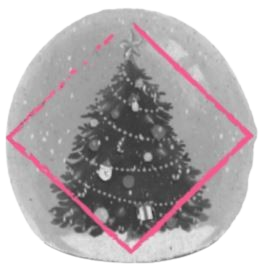

# XMAS - HackMyVM (Easy)
 

## Übersicht

*   **VM:** XMAS
*   **Plattform:** HackMyVM (https://hackmyvm.eu/machines/machine.php?vm=XMAS)
*   **Schwierigkeit:** Easy
*   **Autor der VM:** DarkSpirit
*   **Datum des Writeups:** 8. Mai 2024
*   **Original-Writeup:** https://alientec1908.github.io/XMAS_HackMyVM_Easy/
*   **Autor:** Ben C.

## Kurzbeschreibung

Das Ziel der "XMAS"-Challenge war die Erlangung von User- und Root-Rechten. Der Weg begann mit der Enumeration eines Webservers (Port 80), der auf `christmas.hmv` umleitete. Im Quellcode von `index.php` auf `christmas.hmv` wurde ein GitHub-Link (`nhi-ngo/christmas-countdown`) und potenzielle Benutzernamen/E-Mails gefunden. Eine Analyse des GitHub-Repositorys (impliziert) und eine File-Upload-Schwachstelle auf der Hauptseite (`/`) ermöglichten das Hochladen einer PHP-Webshell (`shell.php`) in das `/uploads/`-Verzeichnis. Dies führte zu Remote Code Execution (RCE) als `www-data`. Als `www-data` wurden MySQL-Root-Credentials (`root:ChristmasMustGon!`) aus der `index.php` extrahiert. In der MySQL-Datenbank `christmas` wurden keine direkten System-User-Credentials gefunden. Die weitere Enumeration als `www-data` offenbarte ein world-writable Python-Skript `/opt/NicerNaughty/nice_or_naughty.py`, das von einem privilegierten Prozess (vermutlich `alabaster`) getriggert wurde, wenn Dateien im `/uploads`-Verzeichnis landeten. Durch Überschreiben dieses Skripts mit einem Python-Reverse-Shell-Payload wurde eine Shell als `alabaster` erlangt. Die User-Flag wurde in dessen Home-Verzeichnis gefunden. Die Privilegieneskalation zu Root erfolgte durch Ausnutzung einer unsicheren `sudo`-Regel: `alabaster` durfte `/usr/bin/java -jar /home/alabaster/PublishList/PublishList.jar` als `root` ohne Passwort ausführen. Durch Ersetzen der `PublishList.jar` mit einem bösartigen JAR (erstellt mit `msfvenom`, enthielt eine Java-Reverse-Shell) wurde eine Root-Shell erlangt.

## Disclaimer / Wichtiger Hinweis

Die in diesem Writeup beschriebenen Techniken und Werkzeuge dienen ausschließlich zu Bildungszwecken im Rahmen von legalen Capture-The-Flag (CTF)-Wettbewerben und Penetrationstests auf Systemen, für die eine ausdrückliche Genehmigung vorliegt. Die Anwendung dieser Methoden auf Systeme ohne Erlaubnis ist illegal. Der Autor übernimmt keine Verantwortung für missbräuchliche Verwendung der hier geteilten Informationen. Handeln Sie stets ethisch und verantwortungsbewusst.

## Verwendete Tools

*   `arp-scan`
*   `vi`
*   `nikto`
*   `nmap`
*   `dirb`
*   `gobuster`
*   `wappalyzer`
*   `hydra` (versucht)
*   `wfuzz`
*   `curl` (impliziert)
*   `nc` (netcat)
*   `mysql` (Client)
*   `cat`
*   `ls`
*   `cd`
*   `python3` (für Reverse Shell und `http.server`)
*   `find` (impliziert)
*   `id`
*   `sudo`
*   `java` (als Exploit-Ziel)
*   `msfvenom`
*   `wget`
*   `mv`
*   `chmod` (impliziert)
*   Standard Linux-Befehle (`echo`, `pwd`, `stty`, `export`, `reset`)
*   GitHub (zur Quellcodeanalyse)

## Lösungsweg (Zusammenfassung)

Der Angriff auf die Maschine "XMAS" gliederte sich in folgende Phasen:

1.  **Reconnaissance & Web Enumeration:**
    *   IP-Findung mit `arp-scan` (`192.168.2.122`). Eintrag von `xmas.hmv` und `christmas.hmv` in `/etc/hosts`.
    *   `nmap`-Scan identifizierte offene Ports: 22 (SSH) und 80 (HTTP - Apache 2.4.55). Port 80 leitete auf `http://christmas.hmv` um.
    *   `nikto`, `dirb`, `gobuster` auf `http://christmas.hmv` fanden Standardverzeichnisse (`/php/`, `/uploads/`) und eine `index.php`. Wappalyzer identifizierte Apache, PHP, Ubuntu, jQuery, Bootstrap.
    *   Quellcode von `index.php` enthielt einen GitHub-Link (`https://github.com/nhi-ngo/christmas-countdown`) und potenzielle Benutzernamen/E-Mails.
    *   SSH-Brute-Force-Versuche auf `alabaster`, `joseph`, `nhi-ngo` mit `rockyou.txt` waren erfolglos.
    *   Subdomain-Enumeration mit `wfuzz` fand `www.christmas.hmv`.

2.  **Initial Access (File Upload zu `www-data`):**
    *   Identifizierung einer File-Upload-Schwachstelle auf der Hauptseite (`/` auf `www.christmas.hmv`).
    *   Hochladen einer PHP-Webshell (`shell.php` mit `<?php system($_GET['cmd']); ?>`) in das `/uploads/`-Verzeichnis.
    *   Ausführung von `http://christmas.hmv/uploads/shell.php?cmd=ls` bestätigte RCE.
    *   Erlangung einer interaktiven Reverse Shell als `www-data` mittels eines Bash-Payloads über die Webshell.

3.  **Privilege Escalation (von `www-data` zu `alabaster` via World-Writable Script):**
    *   Als `www-data` wurde die `index.php` gelesen, die MySQL-Root-Credentials (`root:ChristmasMustGon!`) enthielt.
    *   Login in MySQL. Datenbank `christmas` enthielt Namen, aber keine direkten System-Credentials. `SELECT ... INTO OUTFILE` scheiterte an `secure-file-priv`.
    *   Im Verzeichnis `/opt/NicerNaughty/` wurde das Python-Skript `nice_or_naughty.py` gefunden. Es war world-writable (`-rwxrwxrw-`), gehörte `root` und wurde vermutlich durch einen Datei-Upload in `/var/www/christmas.hmv/uploads/` getriggert. Es schrieb Dateien nach `/home/alabaster/`.
    *   Überschreiben von `nice_or_naughty.py` mit einem Python-Reverse-Shell-Payload.
    *   Auslösen des Triggers (Datei-Upload über Webseite).
    *   Erlangung einer interaktiven Reverse Shell als `alabaster`.
    *   User-Flag `HMV{7bMJ6js7guhQadYDTmBt}` in `/home/alabaster/user.txt` gelesen.

4.  **Privilege Escalation (von `alabaster` zu `root` via `sudo java`):**
    *   `sudo -l` als `alabaster` zeigte: `(ALL : ALL) ALL` (mit Passwort) und `(ALL) NOPASSWD: /usr/bin/java -jar /home/alabaster/PublishList/PublishList.jar`.
    *   Erstellung eines bösartigen Java-JAR-Archivs (`shell.jar`) mit `msfvenom` (`java/shell_reverse_tcp`).
    *   Übertragen von `shell.jar` auf das Zielsystem.
    *   Umbenennen/Ersetzen von `/home/alabaster/PublishList/PublishList.jar` mit der bösartigen `shell.jar`.
    *   Starten eines `nc`-Listeners auf dem Angreifer-System.
    *   Ausführung von `sudo /usr/bin/java -jar /home/alabaster/PublishList/PublishList.jar`.
    *   Erlangung einer Root-Shell.
    *   Root-Flag `HMV{GUbM4sBXzvwf7eC9bNL4}` in `/root/root.txt` gelesen.

## Wichtige Schwachstellen und Konzepte

*   **Exponierter GitHub-Link:** Quellcodeanalyse des öffentlichen Repos konnte Hinweise liefern.
*   **Unsicherer Datei-Upload:** Ermöglichte das Hochladen einer PHP-Webshell und somit RCE.
*   **Klartext-Credentials im Quellcode:** MySQL-Root-Passwort in `index.php`.
*   **World-Writable Script mit privilegiertem Trigger:** Ein von `www-data` beschreibbares Python-Skript wurde von einem höher privilegierten Prozess (vermutlich `alabaster`) ausgeführt.
*   **Unsichere `sudo`-Konfiguration (`java -jar`):** Die Erlaubnis, ein spezifisches JAR-Archiv als `root` ohne Passwort auszuführen, ermöglichte durch Ersetzen des JARs die Ausführung beliebigen Java-Codes als Root.

## Flags

*   **User Flag (`/home/alabaster/user.txt`):** `HMV{7bMJ6js7guhQadYDTmBt}`
*   **Root Flag (`/root/root.txt`):** `HMV{GUbM4sBXzvwf7eC9bNL4}`

## Tags

`HackMyVM`, `XMAS`, `Easy`, `File Upload Vulnerability`, `RCE`, `PHP Webshell`, `MySQL`, `World-Writable Script`, `Python`, `sudo Exploitation`, `Java JAR Exploit`, `msfvenom`, `Privilege Escalation`, `Linux`, `Web`
